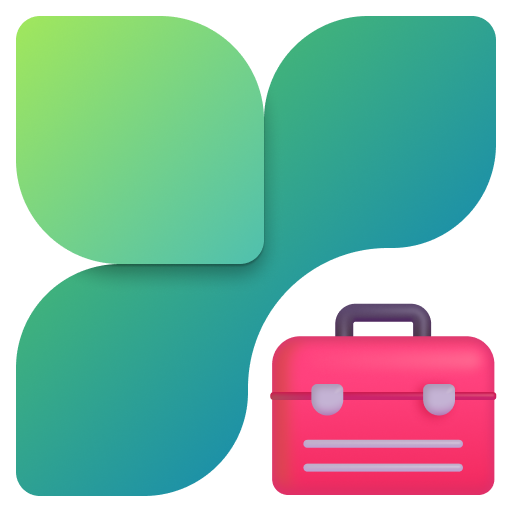

<div align=center>

# MSPCManagerHelper

</div>

## 🖹 Choose Your Language

Please Select Your Language to Continue

請選取你的語言以繼續 | 请选择你的语言以继续

[中文 (繁體)](./docs/README.zh-Hant.md) | [中文 (简体)](./docs/README.zh-Hans.md)

## 👏 Introduction

`MSPCManagerHelper` is a utility (`PCM Assistant`, `PCM Helper` or `Microsoft PC Manager Helper`) that comes with [`Microsoft PC Manager`](https://apps.microsoft.com/detail/9PM860492SZD). This tool is designed to provide users with efficient and convenient solutions to quickly deal with problems they may encounter during use.
Visit <https://pcmanager.microsoft.com> to download and experience the latest version of Microsoft PC Manager and join our [User Community](https://mspcmanager.github.io/mspcm-docs/appendix/social-accounts.html)! 😉

> [!IMPORTANT]
> 
> This tool is not developed or endorsed by Microsoft Corporation or its subsidiaries. The authors are independent developers with no affiliation to Microsoft or its subsidiaries.

> [!NOTE]
> 
> Some features of `MSPCManagerHelper` include references to third-party (non-Microsoft) web pages. While these pages may offer accurate and helpful information, they might also contain advertisements categorized as PUPs (Potentially Unwanted Products). Please exercise caution and thoroughly review any products or files before downloading or installing them.

## 💻 Development

1. Download Python 3.14 from [Python](https://www.python.org/downloads)

2. Clone the Code

    ```bash
    git clone https://github.com/Goo-aw233/MSPCManagerHelper.git
    cd MSPCManagerHelper
    ```

3. Create and Activate a Virtual Environment

    - **Windows**:

        ```Batch
        py -3.14 -m venv .venv
        .venv\Scripts\activate
        ```

    <details>
    <summary>The <code>install_requirements.sh</code> for macOS and Linux is No Longer Available</summary>

    - **macOS / Linux**:

        ```bash
        python3 -m venv .venv
        source .venv/bin/activate
        ```

    </details>

4. Install the pip Packages

    ```Batch
    python -m pip install --upgrade pip
    pip install -r requirements.txt
    ```

    In the `scripts` directory, you can also run `install_requirements.cmd` directly to quickly complete the installation, or run `install_requirements_.venv.cmd` to activate the virtual environment and install the dependencies at the same time.

5. Build the EXE

    Run `build.cmd` or `build_.venv.cmd` directly from the `scripts\build` directory to build it yourself.
    Finally, the built `EXE file` will be stored in the `dist` directory of the root directory and named `MSPCManagerHelper_..._v#.#.#.#_<Arch>.exe`.

> [!NOTE]
> 
> If you want to build with Nuitka, install the following components in [Visual Studio](https://visualstudio.microsoft.com/downloads) (or [Visual Studio Build Tools for C++](https://visualstudio.microsoft.com/visual-cpp-build-tools)):
> - MSBuild Tools
> - Desktop development with C++ (C++ Build Tools core features, Visual C++ v14 redistributable updates, C++ core desktop features, MSVC Build Tools for x64/x86 (latest))
> In a virtual environment, install `Nuitka` and `Zstandard`: 
> 
> ```Batch
> pip install nuitka zstandard
> ```
> 
> Then, move the `build_nuitka_.venv.cmd` script from the `scripts\disabled` folder to the `scripts\build` folder, and use the script to build. It is recommended to use `zig` when building.
